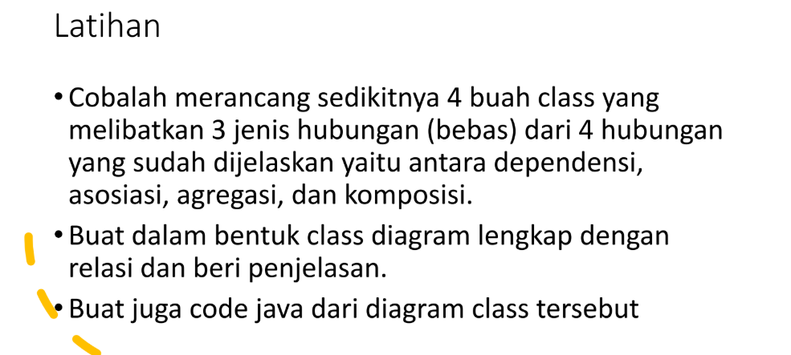
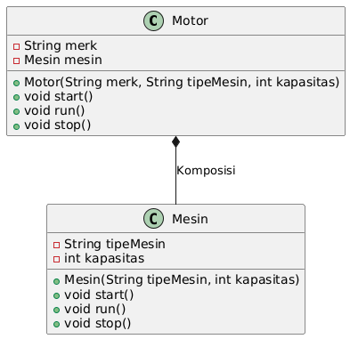
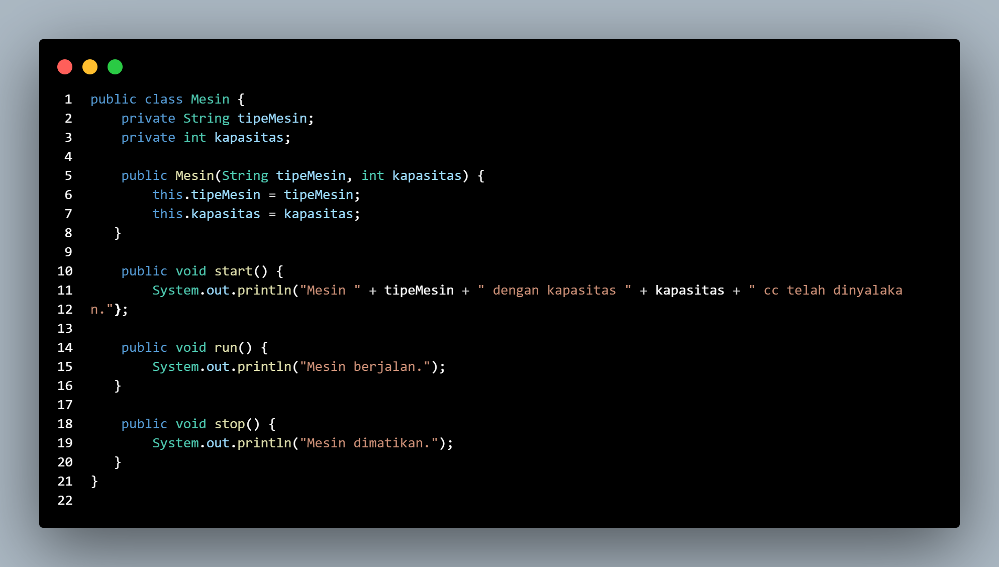
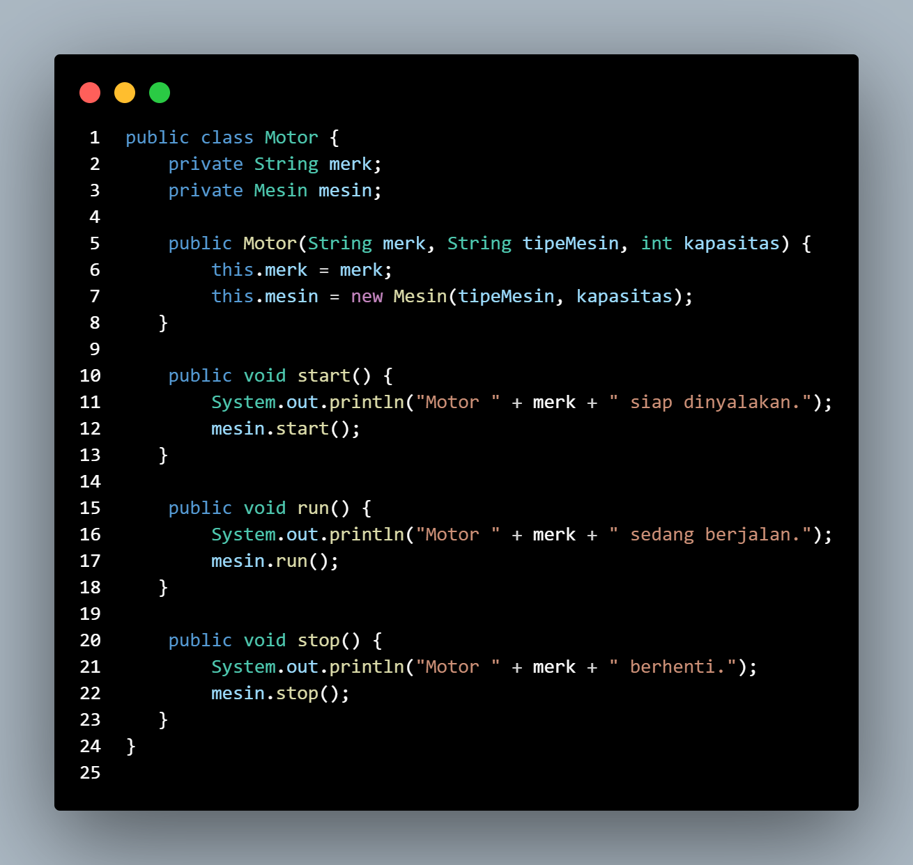
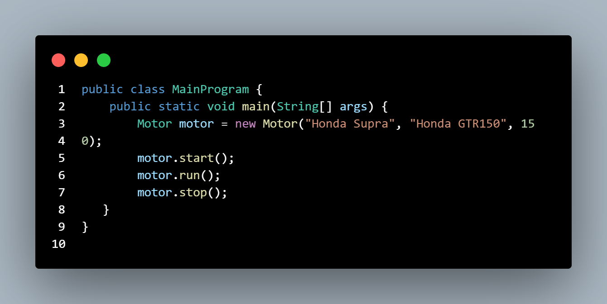
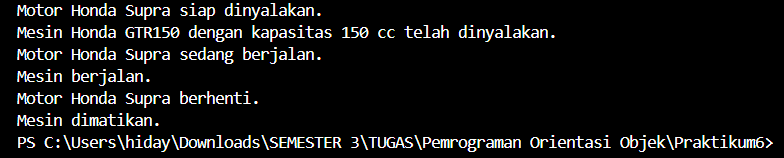

## Relasi Class
| Pertemuan 10  |  Pemrograman Berorientasi Objek  
|-------|---------
| NIM   | 312310576
| Nama  | Taufik Hidayat
| Kelas | TI.23.A6

## Latihan



### Diagram Class



Relasi Komposisi

Komposisi adalah hubungan "memiliki bagian" (has-a) yang kuat. Dalam hal ini:
- Objek Motor memiliki objek Mesin secara langsung di dalamnya.
- Objek Mesin hanya dapat ada selama objek Motor masih ada.
- Ini digambarkan pada diagram dengan rombongan hitam (◆---) yang menunjukkan hubungan komposisi.


Hasilnya akan menggambarkan hubungan komposisi antara Motor dan Mesin:


Diagram menunjukkan:

- Motor adalah kelas utama.
- Mesin adalah bagian tak terpisahkan dari Motor.
- Relasi komposisi digambarkan dengan rombongan hitam antara Motor dan Mesin.

### Class Mesin



Deskripsi
- Kelas Mesin merepresentasikan bagian internal dari Motor. Objek Mesin tidak dapat berdiri sendiri, melainkan selalu terhubung dengan objek Motor.

Atribut:
- tipeMesin: Jenis mesin yang digunakan, misalnya "Honda GTR150".
- kapasitas: Kapasitas mesin dalam cc, misalnya 150 cc.

Metode:
- start(): Menyalakan mesin.
- run(): Menjalankan mesin.
- stop(): Mematikan mesin.

### Class Motor



Kelas Motor merupakan objek utama yang mencakup atribut dan fungsi dari sebuah kendaraan bermotor. Objek Motor menciptakan dan mengontrol objek Mesin.

Atribut:
- merk: Merek dari motor, misalnya "Honda Supra".
- mesin: Objek Mesin yang digunakan motor.

Komposisi:

Objek Motor mengandung objek Mesin. Jika Motor dihancurkan, objek Mesin juga dihancurkan karena Mesin adalah bagian tak terpisahkan dari Motor.

Metode:
- start(): Menyalakan motor, yang juga memanggil metode start() dari objek Mesin.
- run(): Menjalankan motor, yang juga memanggil metode run() dari objek Mesin.
- stop(): Menghentikan motor, yang juga memanggil metode stop() dari objek Mesin.

### Class Main



Kelas ini adalah titik masuk program untuk mendemonstrasikan hubungan antara Motor dan Mesin.

Alur Program:
- Membuat objek Motor dengan merek, tipe mesin, dan kapasitas mesin.
- Memanggil metode start(), run(), dan stop() pada objek Motor.
- Metode-metode ini menunjukkan interaksi antara Motor dan Mesin.

### Output Program

Berikut adalah contoh output ketika program dijalankan:
```
Motor Honda Supra siap dinyalakan.
Mesin Honda GTR150 dengan kapasitas 150 cc telah dinyalakan.
Motor Honda Supra sedang berjalan.
Mesin berjalan.
Motor Honda Supra berhenti.
Mesin dimatikan.
```



Penjelasan dari output:

Ketika motor.start() dipanggil:
- Motor menampilkan pesan bahwa siap dinyalakan.
- Mesin dinyalakan, menampilkan tipe dan kapasitasnya.

Ketika motor.run() dipanggil:
- Motor dan mesin berjalan, masing-masing menampilkan statusnya.

Ketika motor.stop() dipanggil:
- Motor berhenti, dan mesin dimatikan.

### Kesimpulan

Program ini menekankan pentingnya komposisi dalam desain perangkat lunak untuk menunjukkan hubungan yang kuat antar kelas. Dalam kasus ini:

- Motor hanya dapat bekerja jika Mesin berfungsi.
- Mesin tidak dapat eksis tanpa objek Motor.

## selesai
